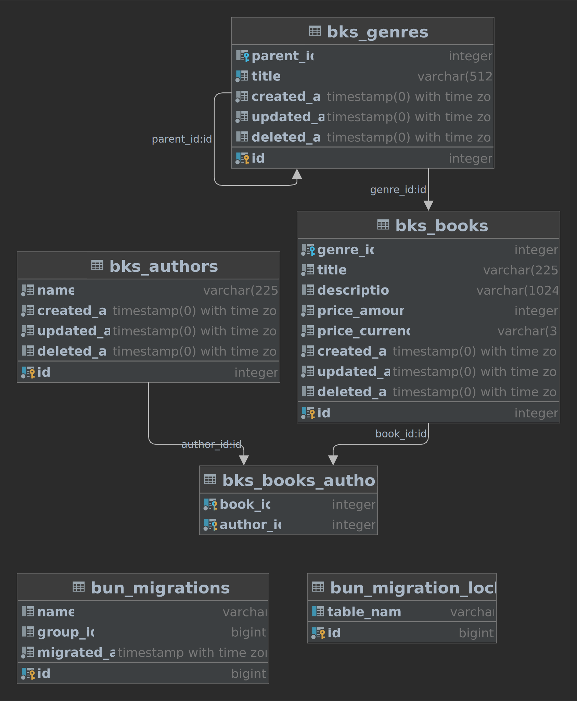

# go-ddd-example

This is small example of go application using DDD approach. Application used postgresql as a data source. Graphql used as API for data querying and mutations.

## Quick start

1. ```git clone https://github.com/aso779/go-ddd-example.git```
2. ```docker-compose up```
3. open in browser [localhost:8002](http://localhost:8002) or connect directly to graphql endpoint on [localhost:8002/graphql](http://localhost:8002/graphql)

Optionally you could import [postman collection](/postman_collection.json) with request examples

## Technical stack

- go 1.18
- postgresql 13

### Go third party packages

- [github.com/go-chi/chi/v5](https://github.com/go-chi/chi/v5)
- [github.com/99designs/gqlgen](https://github.com/99designs/gqlgen)
- [github.com/uptrace/bun](https://github.com/uptrace/bun)
- [go.uber.org/dig](https://go.uber.org/dig)
- [go.uber.org/zap](https://go.uber.org/zap)
- [gopkg.in/yaml.v2](https://gopkg.in/yaml.v2)
- [github.com/aso779/go-ddd](https://github.com/aso779/go-ddd)

## Data structure



## Graphql operations

```graphql
type Query{
    bookOne(filter: BookFilter!): Book!
    bookPage(filter: BookFilter, page: Page, sort: BookSort): BookPage!
}

type Mutation{
    bookOneCreate(input: BookOneCreateInput!): Book!
    bookOneUpdate(input: BookOneUpdateInput!): Book!
    bookDelete(filter: BookFilter!): Int!
    authorOneCreate(input: AuthorOneCreateInput!): Author!
    authorOneUpdate(input: AuthorOneUpdateInput!): Author!
    genreOneCreate(input: GenreOneCreateInput!): Genre!
    genreOneUpdate(input: GenreOneUpdateInput!): Genre!
}
```